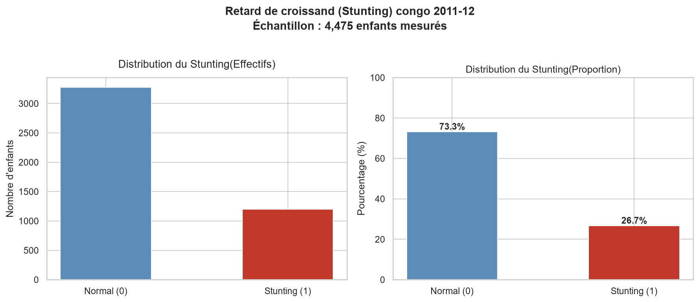
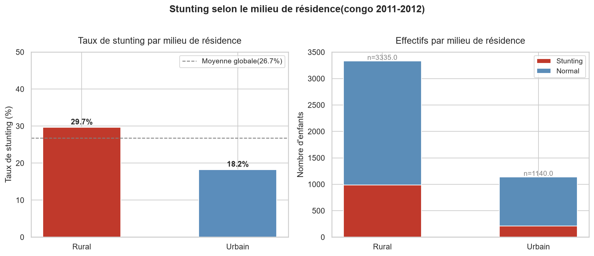
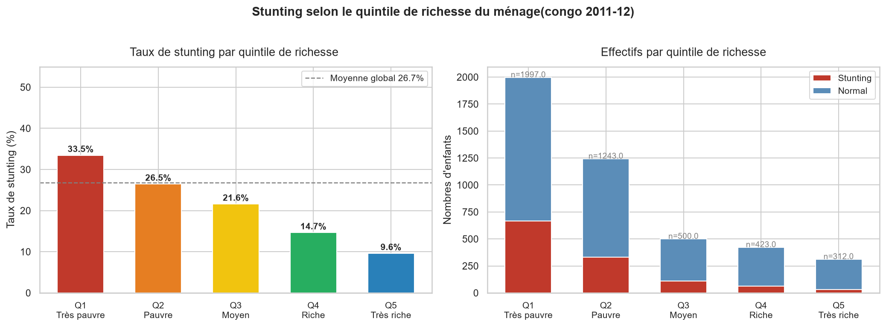
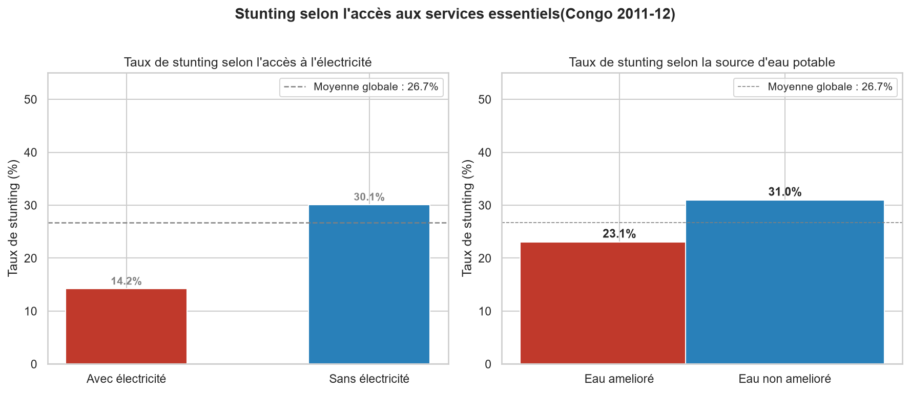
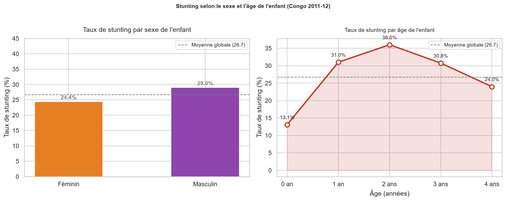
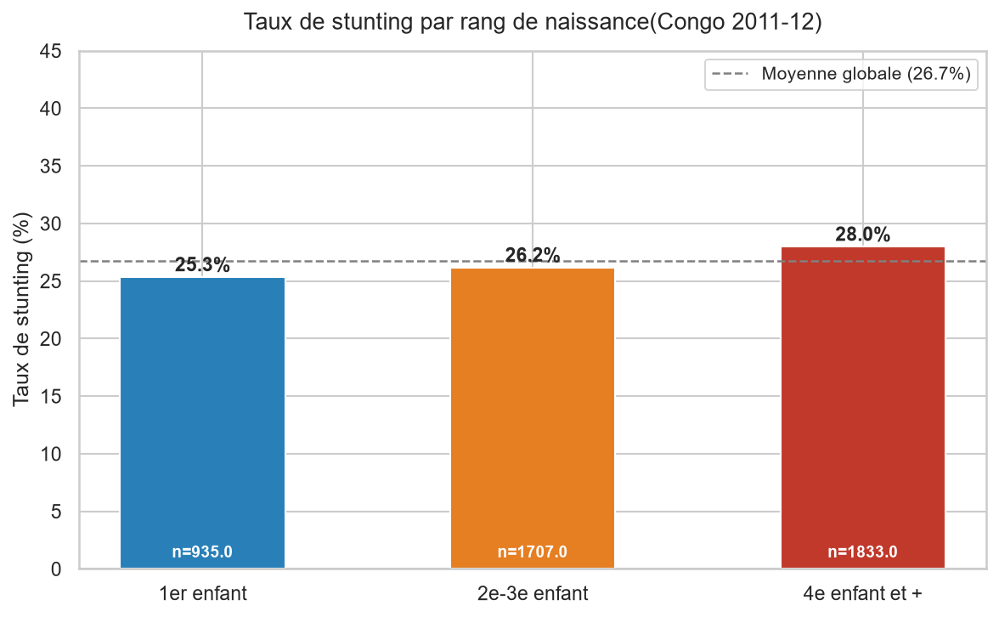
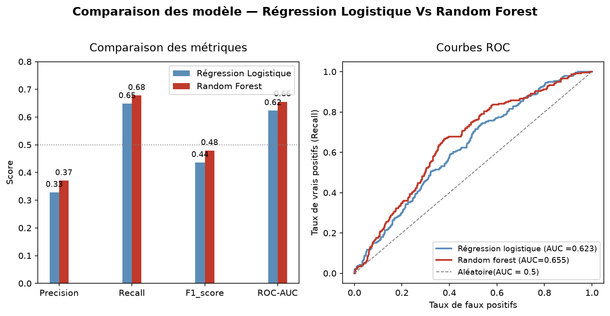
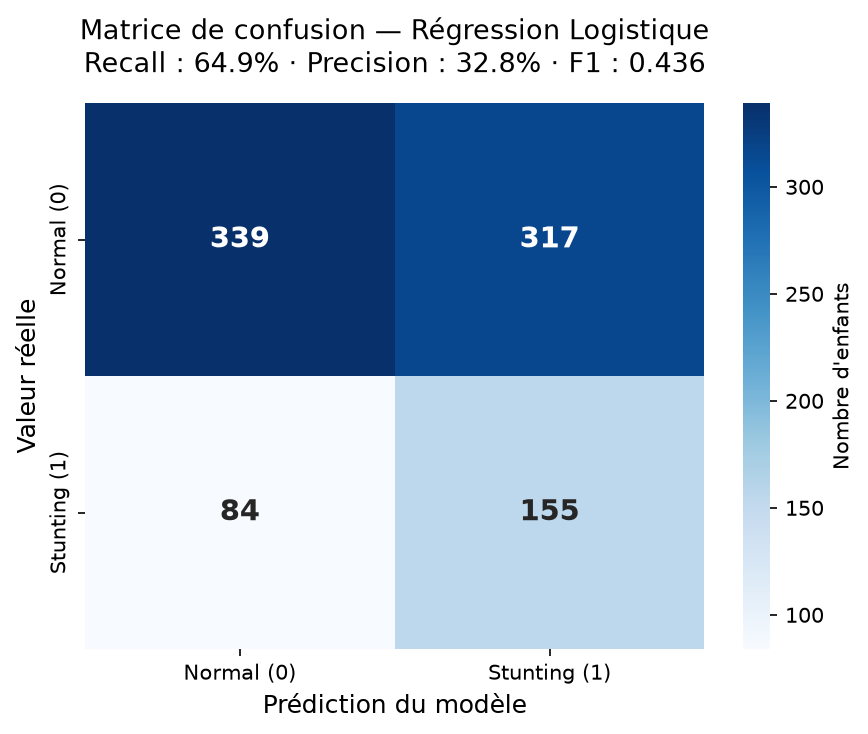
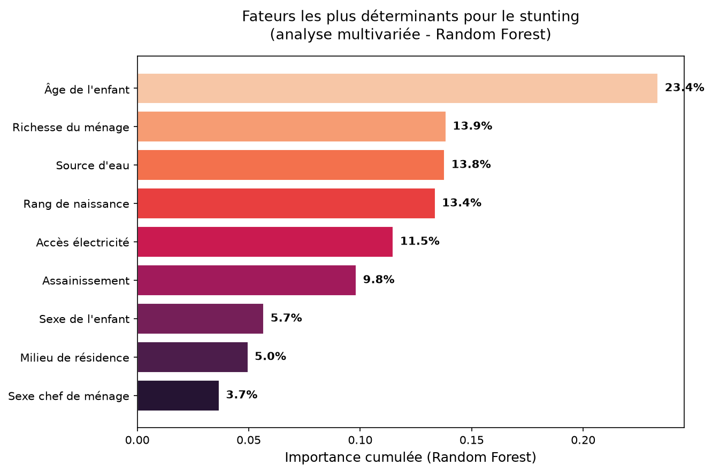

# Rapport d'utilisation des données DHS
**Projet :** Déterminants socio-démographiques de la malnutrition 
infantile en République du Congo  
**Auteur :** MPOY Schekina Lutte-de-vie  
**Institution :** Université Denis Sassou Nguesso (UDSN), Kintélé  
**Email :** mpoyschekinaluttedevie@gmail.com  
**Date de début :** 19 juin 2026  
**Statut :** Finalisé — soumis au DHS Program

---

## 1. Description des données utilisées

### 1.1 Source

Les données utilisées dans ce projet sont issues du Programme 
des Enquêtes Démographiques et de Santé (DHS Program), financé 
par l'USAID. L'accès aux microdonnées a été obtenu dans le cadre 
d'une demande académique approuvée le 22 juin 2026.

### 1.2 Fichiers utilisés

| Pays | Enquête | Fichier | Lignes | Colonnes |
|---|---|---|---|---|
| Congo (Brazzaville) | Standard DHS 2011-12 | CGKR61FL.DTA (Children's Recode) | 9 329 | 1 110 |
| Congo (Brazzaville) | Standard DHS 2011-12 | CGHR61FL.DTA (Household Recode) | 11 632 | 3 194 |

*Les fichiers RDC 2023-24 et Cameroun 2018 seront intégrés 
dans la phase de comparaison régionale.*

### 1.3 Préparation des données

Après chargement des fichiers bruts, les étapes suivantes 
ont été appliquées :

1. **Sélection des variables pertinentes** : 8 variables 
retenues dans KR (Z-scores anthropométriques, identifiants 
démographiques, clés de jointure) et 8 dans HR (caractéristiques 
socio-économiques du ménage).

2. **Traitement des codes aberrants DHS** : 146 valeurs 
>= 9000 sur la variable hw70 (codes 9996, 9998, 9999 
signalant des mesures manquantes ou hors limites) ont été 
remplacées par NaN avant la conversion en Z-scores réels 
(division par 100).

3. **Exclusion des observations sans mesures anthropométriques** : 
4 854 lignes sans Z-score taille/âge (hw70) ont été exclues, 
correspondant à des enfants non présents lors de la mesure. 
Le dataset effectif est de **4 475 enfants mesurés**.

4. **Fusion KR + HR** : Les deux fichiers ont été joints 
sur la clé composite cluster/ménage. La fusion 
est complète, aucun enfant sans correspondance ménage, 
0 valeur manquante introduite.

5. **Construction de la variable cible** : La variable 
binaire `stunting` a été créée selon le seuil OMS standard 
(Z-score taille/âge < -2.0).

### 1.4 Distribution de la variable cible

| Statut | Effectif | Proportion |
|---|---|---|
| Stunting (retard de croissance) | 1 197 | 26.7% |
| Normal | 3 278 | 73.3% |
| **Total** | **4 475** | **100%** |

Un déséquilibre modéré est observé (26.7% de cas positifs). 
La stratégie retenue pour la modélisation est l'utilisation 
de `class_weight='balanced'` dans les modèles scikit-learn.

---

## 2. Résultats de l'analyse exploratoire

### 2.1 Facteurs socio-démographiques associés au stunting

L'analyse exploratoire a examiné sept facteurs socio-démographiques 
disponibles dans les données DHS Congo 2011-12, en comparant le 
taux de stunting entre groupes.

| Facteur | Groupe le plus exposé | Taux | Groupe le moins exposé | Taux | Écart |
|---|---|---|---|---|---|
| Richesse du ménage | Q1-Très pauvre | 33.5% | Q5-Très riche | 9.6% | 23.9 pts |
| Âge de l'enfant | 2 ans | 36.0% | 0 an | 13.1% | 22.9 pts |
| Accès à l'électricité | Sans électricité | 30.1% | Avec électricité | 14.2% | 15.9 pts |
| Milieu de résidence | Rural | 29.7% | Urbain | 18.2% | 11.5 pts |
| Source d'eau potable | Non améliorée | 31.0% | Améliorée | 23.1% | 7.9 pts |
| Sexe de l'enfant | Masculin | 29.0% | Féminin | 24.4% | 4.6 pts |
| Rang de naissance | 4e enfant et + | 28.0% | 1er enfant | 25.3% | 2.7 pts |

### 2.2 Observations clés

**Le niveau de richesse du ménage est le facteur le plus 
discriminant observé.** L'écart de 23.9 points entre le quintile 
le plus pauvre et le plus riche dépasse celui de tous les autres 
facteurs pris individuellement.

**L'âge suit un schéma en cloche caractéristique de la "fenêtre 
des 1000 jours".** Le taux de stunting passe de 13.1% à la 
naissance à un pic de 36.0% vers 2 ans, avant de redescendre 
légèrement, cohérent avec la littérature scientifique sur la 
période critique de développement nutritionnel.

**Les facteurs d'accès aux services essentiels (électricité, eau) 
montrent un gradient cohérent avec l'hypothèse de départ** : 
l'accès limité aux infrastructures de base est associé à un 
risque accru de malnutrition chronique.

**Le sexe et le rang de naissance ont un effet réel mais modeste** 
comparé aux facteurs socio-économiques et à l'âge.

### 2.3 Limite méthodologique

Cette analyse est univariée : chaque facteur est examiné 
indépendamment des autres. Or, richesse, électricité, accès 
à l'eau et milieu de résidence sont vraisemblablement corrélés 
entre eux (un ménage rural pauvre cumule souvent plusieurs 
désavantages simultanément). Cette analyse ne permet donc pas 
d'isoler l'effet propre de chaque variable une fois les autres 
prises en compte.

La modélisation multivariée (section 3) permettra d'estimer 
l'importance relative de chaque facteur en tenant compte des 
autres simultanément.

## 3. Résultats de la modélisation

### 3.1 Approche méthodologique

Deux modèles de classification supervisée ont été construits 
et comparés afin de prédire le risque de retard de croissance 
(stunting) à partir de neuf variables socio-démographiques : 
milieu de résidence, indice de richesse du ménage, source 
d'eau potable, type d'assainissement, accès à l'électricité, 
sexe du chef de ménage, sexe de l'enfant, âge de l'enfant et 
rang de naissance.

Les données ont été séparées en un ensemble d'entraînement 
(80%, 3 580 observations) et un ensemble de test (20%, 895 
observations), avec stratification selon la variable cible 
afin de préserver la même proportion de cas positifs dans 
les deux ensembles (26.7%).

Le prétraitement des données (imputation des valeurs manquantes, 
encodage des variables catégorielles, mise à l'échelle) a été 
intégré dans un pipeline scikit-learn appris exclusivement sur 
l'ensemble d'entraînement, conformément aux bonnes pratiques 
de prévention de la fuite de données entre les phases 
d'apprentissage et d'évaluation.

Étant donné le déséquilibre modéré de la variable cible (26.7% 
de cas positifs), les modèles ont été entraînés avec une 
pondération équilibrée des classes (`class_weight='balanced'`), 
et l'évaluation a privilégié des métriques adaptées à ce contexte 
(F1-score, rappel, aire sous la courbe ROC) plutôt que l'exactitude 
globale, connue pour être trompeuse sur des données déséquilibrées.

### 3.2 Modèles évalués

**Modèle de référence — Régression logistique**

| Métrique | Valeur |
|---|---|
| Precision | 0.328 |
| Recall | 0.649 |
| F1-score | 0.436 |
| ROC-AUC | 0.623 |

**Modèle de comparaison — Random Forest** 
(200 arbres, profondeur maximale de 8 niveaux)

| Métrique | Valeur |
|---|---|
| Precision | 0.371 |
| Recall | 0.678 |
| F1-score | 0.479 |
| ROC-AUC | 0.655 |

Le modèle Random Forest surpasse la régression logistique sur 
l'ensemble des quatre métriques d'évaluation, avec une amélioration 
modérée mais constante. Ce résultat est cohérent avec les 
observations de l'analyse exploratoire, qui avait mis en évidence 
une relation non linéaire entre l'âge de l'enfant et le risque 
de stunting — une relation que le Random Forest est structurellement 
mieux à même de capturer qu'un modèle linéaire.

Le Random Forest a été retenu comme modèle final, tant pour ses 
performances supérieures que pour l'interprétabilité qu'offre 
l'analyse de l'importance des variables.

### 3.3 Importance des variables (analyse multivariée)

L'analyse de l'importance des variables du modèle Random Forest 
permet d'estimer la contribution de chaque facteur à la prédiction, 
une fois l'ensemble des autres facteurs pris en compte 
simultanément — une lecture complémentaire à l'analyse univariée 
présentée en section 2.

| Rang | Variable | Importance |
|---|---|---|
| 1 | Âge de l'enfant | 23.4% |
| 2 | Richesse du ménage | 13.9% |
| 3 | Source d'eau potable | 13.8% |
| 4 | Rang de naissance | 13.4% |
| 5 | Accès à l'électricité | 11.5% |
| 6 | Assainissement | 9.8% |
| 7 | Sexe de l'enfant | 5.7% |
| 8 | Milieu de résidence | 5.0% |
| 9 | Sexe du chef de ménage | 3.7% |

**L'âge de l'enfant demeure le facteur le plus déterminant** 
dans l'analyse multivariée, confirmant l'observation faite en 
section 2 concernant la fenêtre critique des 1 000 premiers 
jours de vie.

**Le rang de naissance présente un résultat notable** : alors 
que l'analyse univariée (section 2) ne montrait qu'un écart 
modeste de 2.7 points de pourcentage entre le premier enfant 
et les enfants de rang 4 et plus, son importance relative dans 
le modèle multivarié (13.4%) est nettement supérieure à ce que 
suggérait l'analyse descriptive seule. Ce résultat illustre 
l'intérêt d'une approche multivariée pour révéler des effets 
masqués par des interactions entre variables.

**Le milieu de résidence, en revanche, voit son importance 
relative diminuer fortement** dans l'analyse multivariée (5.0%, 
avant-dernier rang) par rapport à son poids apparent dans 
l'analyse univariée (écart de 11.5 points, quatrième rang). 
Cette diminution suggère que l'effet du milieu de résidence 
observé en analyse univariée est en grande partie capté par 
d'autres variables corrélées, notamment la richesse du ménage 
et l'accès aux infrastructures de base.

### 3.4 Limites du modèle

Les performances du modèle final restent modestes (F1-score de 
0.479, ROC-AUC de 0.655), ce qui indique que les neuf variables 
socio-démographiques disponibles n'expliquent qu'une partie 
limitée du phénomène observé. Cette limite est cohérente avec 
la littérature sur les déterminants de la malnutrition infantile, 
qui identifie généralement des facteurs additionnels non mesurés 
dans le présent modèle, tels que les pratiques alimentaires du 
nourrisson, l'état de santé maternelle, l'historique des maladies 
infectieuses de l'enfant, ou la diversité du régime alimentaire 
du ménage.

La stratégie de pondération équilibrée des classes, choisie pour 
privilégier la détection des cas à risque (rappel) dans une 
perspective de santé publique, entraîne un nombre significatif 
de faux positifs (precision de 0.371). Ce compromis est jugé 
acceptable dans un contexte de ciblage préventif, où le coût 
de ne pas détecter un enfant réellement à risque est considéré 
comme supérieur au coût d'un dépistage complémentaire inutile.

Enfin, le modèle a été entraîné et évalué exclusivement sur les 
données du Congo (Brazzaville) issues de l'enquête DHS 2011-12. 
Sa capacité de généralisation à d'autres contextes nationaux ou 
à des périodes plus récentes n'a pas été testée à ce stade du 
projet.

## 4. Conclusions et limites générales

### 4.1 Synthèse des résultats

Cette étude a analysé les facteurs socio-démographiques associés 
au retard de croissance (stunting) chez 4 475 enfants de moins 
de cinq ans au Congo (Brazzaville), à partir des microdonnées 
de l'Enquête Démographique et de Santé 2011-12.

Le taux global de stunting observé dans l'échantillon est de 
26.7%, cohérent avec les niveaux rapportés dans la littérature 
sur la malnutrition chronique en Afrique centrale pour la période 
considérée.

L'analyse exploratoire univariée a mis en évidence des écarts 
significatifs selon plusieurs facteurs, le plus marqué étant le 
niveau de richesse du ménage (écart de 23.9 points de pourcentage 
entre le quintile le plus pauvre et le plus riche), suivi par 
l'âge de l'enfant, qui présente une évolution en cloche 
caractéristique de la fenêtre critique des 1 000 premiers jours 
de vie (pic de 36.0% vers l'âge de deux ans).

La modélisation par apprentissage supervisé, comparant une 
régression logistique et un modèle Random Forest, confirme 
l'importance prépondérante de l'âge de l'enfant dans une 
perspective multivariée (23.4% de l'importance du modèle retenu), 
et révèle un résultat notable : le rang de naissance, dont 
l'effet apparaissait modeste en analyse univariée, se révèle 
nettement plus déterminant une fois les interactions entre 
variables prises en compte (13.4% d'importance, quatrième facteur 
le plus déterminant).

### 4.2 Portée et limites de l'étude

Les résultats de cette étude doivent être interprétés à la lumière 
de plusieurs limites méthodologiques.

**Nature transversale des données.** L'enquête DHS 2011-12 constitue 
une photographie à un instant donné. Les relations observées entre 
facteurs socio-démographiques et stunting sont de nature associative 
et ne permettent pas d'établir de lien de causalité directe.

**Variables disponibles limitées.** Le modèle repose sur neuf 
variables socio-démographiques et ne permet d'expliquer qu'une 
partie du phénomène observé, ce qui se traduit par des performances 
prédictives modestes (F1-score de 0.479, aire sous la courbe ROC 
de 0.655). Des facteurs additionnels reconnus dans la littérature 
sur la malnutrition infantile — pratiques d'allaitement, diversité 
alimentaire du nourrisson, état de santé maternelle, historique 
des épisodes infectieux — n'ont pas été intégrés dans cette phase 
de l'analyse.

**Ancienneté relative des données.** L'enquête utilisée date de 
2011-12. La situation nutritionnelle actuelle au Congo peut différer 
de celle observée à cette période, notamment en raison de 
l'évolution des conditions socio-économiques et des politiques 
publiques mises en œuvre depuis lors.

**Portée géographique.** L'analyse est circonscrite au Congo 
(Brazzaville). Aucune généralisation à d'autres contextes nationaux 
n'a été testée dans cette phase du projet, bien que l'accès aux 
données de la République Démocratique du Congo et du Cameroun ait 
été obtenu en vue d'une possible extension comparative ultérieure.

### 4.3 Apport et perspectives

Cette étude illustre l'intérêt d'une approche combinant analyse 
exploratoire et modélisation prédictive pour documenter les 
disparités nutritionnelles infantiles à partir de données 
individuelles, plutôt que d'indicateurs macroéconomiques agrégés. 
La méthodologie développée — nettoyage structuré des microdonnées 
DHS, gestion rigoureuse du déséquilibre de classes, analyse 
multivariée de l'importance des variables — est reproductible et 
transposable à d'autres enquêtes DHS ou à d'autres indicateurs 
de malnutrition infantile (insuffisance pondérale, émaciation).

Les résultats, notamment l'importance relative de l'âge de l'enfant 
et du rang de naissance, pourraient utilement informer la 
conception de programmes de ciblage nutritionnel priorisant les 
enfants dans leur seconde année de vie et les familles nombreuses, 
en complément des critères de ciblage géographique et économique 
classiquement utilisés.

---

**Citation des données :**  
The DHS Program, Congo Standard DHS 2011-12. ICF International, 
Rockville, Maryland, USA.

**Auteur du rapport :** MPOY Schekina Lutte-
De-Vie  
**Institution :** Université Denis Sassou Nguesso (UDSN), Kintélé, 
République du Congo  
**Contact :** mpoyschekinaluttedevie@gmail.com